# FORMA · 18 个真实示例 / 18 real examples

以下图片直接截取自本仓库的 Three.js 应用，包含实际界面与渲染结果。每张为 1280 × 800 的 JPEG；共用 seed 42、默认参数、高画质和固定镜头。它们不是原始上传照片，也不是生成式效果图。

These images are actual screenshots of this repository’s Three.js application, including the interface and rendered scenes. Every JPEG is 1280 × 800, using seed 42, default parameters, high quality, and a fixed camera. They are neither uploaded reference photographs nor generated mockups.

[机器可读索引 / Machine-readable index](screenshots/manifest.json) 提供每个示例的双语名称、参数、模型边界、研究来源、源码路径、原始图片 URL 与 SHA-256。相同 seed 与参数可复现模型状态；不同 GPU、浏览器和字体可能产生像素差异。

The machine-readable index includes bilingual names, parameters, model limits, research sources, source paths, raw image URLs, and SHA-256 hashes. The same seed and parameters reproduce model state; GPU, browser, and font differences can affect pixels.

截图使用虚拟时钟，画面中的 FPS 不作为性能测量；性能条件见 QA_REPORT.md。

Captures use a virtual clock; the displayed FPS is not a performance measurement. See QA_REPORT.md for measured conditions.

## 重新生成 / Regenerate

先安装构建依赖与 Playwright，再安装或使用本机 Google Chrome。截图脚本不连接模型 API，也不需要运行本地服务器。已有 Playwright 时，可通过 `PLAYWRIGHT_MODULE` 指向其模块入口。

Install the build dependencies and Playwright, then install or use a local Google Chrome. The capture script requires no model API or local server. If Playwright is already available elsewhere, set `PLAYWRIGHT_MODULE` to its module entry point.

```sh
npm ci
npm install --no-save --package-lock=false playwright@1.62.1
npx playwright install chrome
npm run build
node scripts/capture-examples.mjs
```

脚本开启低动态偏好，暂停自动镜头与模拟；海水与硬球碰撞单独推进 2,000 ms 的浏览器虚拟时间后暂停，以呈现尾流和碰撞历史。界面模拟时间与相机坐标逐图记录在索引中。硬球初态另含固定的 2.4 模型秒预演，记录为 initialGasWarmupSeconds；其余场景取界面时间 0，火花预热按模型说明进行。

The script enables reduced motion and pauses camera and simulation. Ocean and hard spheres advance by 2,000 ms of browser virtual time before pausing. The index records UI simulation time and camera coordinates. Gas initialization also includes a fixed 2.4-model-second warmup, recorded as initialGasWarmupSeconds. Other scenes use UI time 0; sparks are prewarmed as described in the app.

## 01 · N–S · 涡旋之心 / Navier–Stokes vortex concentration

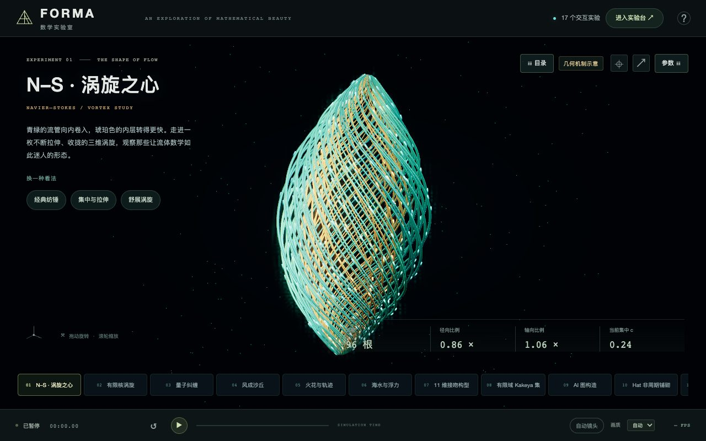

青绿与琥珀色流管组成细长涡旋，示意收缩、旋转与轴向拉伸。

Teal and amber stream tubes form a spindle that illustrates contraction, rotation, and axial stretching.

模型边界：有限参数几何示意，不是 Navier–Stokes 数值求解器，也不是公告证明或原始速度场的复现。收缩始终有下界；循环接头是显示截断。不能从此图推出奇点、有限能量或完整流场的不可压缩性。截图中的 GPT6 ASTRA 面板属于社媒视觉参考，不视为官方计算数据。Clay 状态仅按 2026-09-09 的核验记录标为 Unsolved。

打开 / Open: `index.html#navier` · t = 0.000 s · seed = 42.

[场景 / Scene](../src/experiments/navier.js) · [数学 / Math](../src/math/navier.js) · [原始图片 / Raw JPEG](https://raw.githubusercontent.com/aelf-hzz780/math-lab-3js/main/docs/screenshots/01-navier.jpg)

- [2026-09-08 · OpenAI 研究公告与原图说明](https://openai.com/index/navier-stokes-solution/)
- [Clay Mathematics Institute · 问题与状态](https://www.claymath.org/millennium/navier-stokes-equation/)

## 02 · 有限核涡旋 / Finite-core Burgers vortex


发光的螺旋流线环绕有限涡核，粒子展示径向收缩与轴向运动。

Glowing helical streamlines wrap a finite vortex core while tracers show radial contraction and axial motion.

模型边界：解析教学模型，不是 LBM、DNS 或 OpenAI 2026 证明的复现。所有有限正黏度、正拉伸参数下核心光滑；画面收缩不表示有限时间奇点。流线以有限时间与有限空间截断，边缘重新出现的点是可视化示踪粒子。

打开 / Open: `index.html#vortex` · t = 0.000 s · seed = 42.

[场景 / Scene](../src/experiments/vortex.js) · [数学 / Math](../src/math/vortex.js) · [原始图片 / Raw JPEG](https://raw.githubusercontent.com/aelf-hzz780/math-lab-3js/main/docs/screenshots/02-vortex.jpg)

- [Burgers vortex · 模型与方程](https://en.wikipedia.org/wiki/Burgers_vortex)
- [2026-09-08 · OpenAI 原始研究公告](https://openai.com/index/navier-stokes-solution/)
- [Clay Mathematics Institute · 问题与状态](https://www.claymath.org/millennium/navier-stokes-equation/)

## 03 · 量子纠缠 / Quantum entanglement probability surface

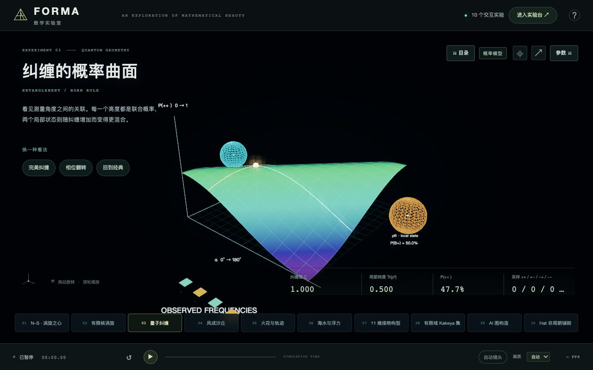

彩色概率曲面连接两端测量角度，展示双量子比特的联合概率。

A luminous probability surface maps two measurement angles to the joint outcome probability of two qubits.

模型边界：这是一张概率函数曲面，不是粒子的实际空间形状，也不是完整 Hilbert 空间的三维等价物。远端测量设置不改变本端边缘概率，不能用于超光速通信。改变任一参数会清空旧设置的采样统计。

打开 / Open: `index.html#quantum` · t = 0.000 s · seed = 42.

[场景 / Scene](../src/experiments/quantum.js) · [数学 / Math](../src/math/quantum.js) · [原始图片 / Raw JPEG](https://raw.githubusercontent.com/aelf-hzz780/math-lab-3js/main/docs/screenshots/03-quantum.jpg)

- [Bell 1964 · On the Einstein Podolsky Rosen paradox](https://doi.org/10.1103/PhysicsPhysiqueFizika.1.195)

## 04 · 风成沙丘 / Wind-shaped sand dunes

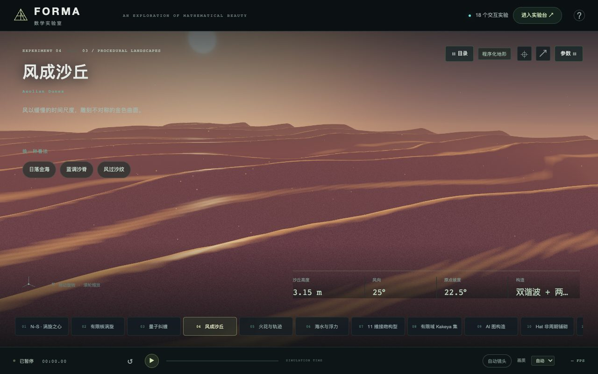

暖色掠射光照亮起伏沙脊与程序化细沙纹。

Warm grazing light reveals rolling dune crests and fine procedural sand ripples.

模型边界：这是可解释的程序化高度场，不求解沙粒输运方程，也不代表新发现的数学结构。移动速度是整体平移的演示参数；没有模拟侵蚀和崩塌。少量悬浮光点是用于表现风向的沙尘视觉层，不计算真实沙粒输运。

打开 / Open: `index.html#dunes` · t = 0.000 s · seed = 42.

[场景 / Scene](../src/experiments/dunes.js) · [数学 / Math](../src/math/dunes.js) · [原始图片 / Raw JPEG](https://raw.githubusercontent.com/aelf-hzz780/math-lab-3js/main/docs/screenshots/04-dunes.jpg)

- [Bagnold · The Physics of Blown Sand and Desert Dunes (1941)](https://doi.org/10.1007/978-94-009-5682-7)
- [GPU Gems · Improved Perlin Noise](https://developer.nvidia.com/gpugems/gpugems/part-i-natural-effects/chapter-5-implementing-improved-perlin-noise)

## 05 · 火花与轨迹 / Sparks and analytic particle trails


金色火花形成喷泉，短拖尾描出重力与线性阻力下的运动。

A fountain of golden sparks leaves short trails governed by gravity and linear drag.

模型边界：用于解释运动和粒子系统，不模拟真实燃烧、热传导或复杂空气湍流。粒子互不碰撞；轨迹池持续循环，颜色与亮度是视觉编码。发射率受当前画质的粒子池预算限制，指标显示实际发射率。

打开 / Open: `index.html#sparks` · t = 0.000 s · seed = 42.

[场景 / Scene](../src/experiments/sparks.js) · [数学 / Math](../src/math/sparks.js) · [原始图片 / Raw JPEG](https://raw.githubusercontent.com/aelf-hzz780/math-lab-3js/main/docs/screenshots/05-sparks.jpg)

- [Linear drag · 解析运动模型](https://en.wikipedia.org/wiki/Projectile_motion#Trajectory_of_a_projectile_with_air_resistance)

## 06 · 海水与浮力 / Ocean waves, buoyancy, and wakes

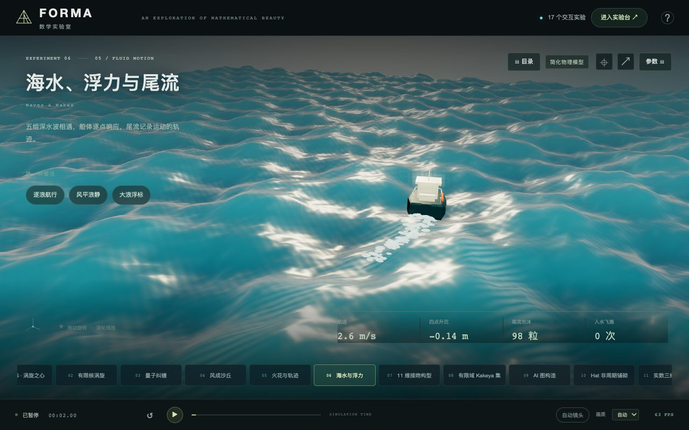

程序化小船穿过深水波叠加形成的水面，身后可见近似尾流与泡沫。

A procedural boat crosses superposed deep-water waves, leaving an approximate wake and foam.

模型边界：波面是线性深水波叠加，不是完整 Navier–Stokes 求解器。尾流采用约 19.47° 的 Kelvin 楔形视觉近似；泡沫和飞溅不反作用于波场，浮力采用离散船底和小角度近似。

打开 / Open: `index.html#ocean` · t = 2.000 s · seed = 42.

[场景 / Scene](../src/experiments/ocean.js) · [数学 / Math](../src/math/ocean.js) · [原始图片 / Raw JPEG](https://raw.githubusercontent.com/aelf-hzz780/math-lab-3js/main/docs/screenshots/06-ocean.jpg)

- [MIT · Deep Water Waves](https://web.mit.edu/fluids-modules/www/waves.html)
- [Kelvin ship-wave pattern · Encyclopedia of Mathematics](https://encyclopediaofmath.org/wiki/Kelvin_ship-wave_pattern)
- [GPU Gems · Effective Water Simulation](https://developer.nvidia.com/gpugems/gpugems/part-i-natural-effects/chapter-1-effective-water-simulation-physical-models)

## 07 · 11 维接吻构型 / 604-point kissing configuration in 11 dimensions


三维投影中的蓝金色点云显示 604 点构型，细线标出选中点的真实高维接触。

A blue and gold 3D projection shows a 604-point configuration; lines mark the selected point’s actual high-dimensional contacts.

模型边界：这是十一维结构的三维正交投影；画面距离与重叠不代表原空间中的距离。604 是下界，尚未宣称接吻数恰为 604。

打开 / Open: `index.html#kissing` · t = 0.000 s · seed = 42.

[场景 / Scene](../src/experiments/kissing.js) · [数学 / Math](../src/math/kissing.js) · [原始图片 / Raw JPEG](https://raw.githubusercontent.com/aelf-hzz780/math-lab-3js/main/docs/screenshots/07-kissing.jpg)

- [Station · 论文与三套精确构造](https://arxiv.org/abs/2608.23691)
- [原始坐标与验证证书](https://github.com/dualverse-ai/station_data_v2/tree/main/artifacts/kissing_number)

## 08 · 有限域 Kakeya 集 / Finite-field Kakeya set

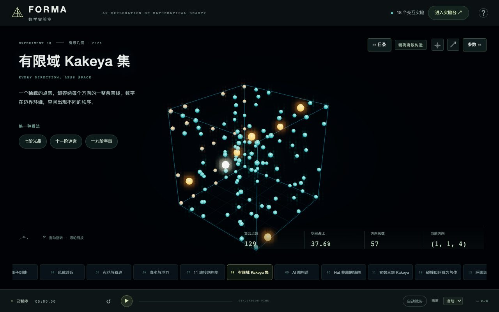

离散光点在模素数网格中排列，金色点突出一个方向的完整直线。

Discrete luminous points occupy a prime-modulus grid, with a complete line in one direction highlighted in gold.

模型边界：有限域里的直线是模运算点集。白色光点按参数 t 遍历整条直线，跨边界时不会画出误导性的欧式长线。该家族不代表每个 p 的最小可能点集。

打开 / Open: `index.html#kakeya` · t = 0.000 s · seed = 42.

[场景 / Scene](../src/experiments/kakeya.js) · [数学 / Math](../src/math/kakeya.js) · [原始图片 / Raw JPEG](https://raw.githubusercontent.com/aelf-hzz780/math-lab-3js/main/docs/screenshots/08-kakeya.jpg)

- [Station · 新无限家族论文](https://arxiv.org/abs/2608.23691)
- [精确公式与方向见证](https://github.com/dualverse-ai/station_data_v2/tree/main/artifacts/finite_kakeya)

## 09 · AI 图构造 / AI-discovered MAX-4-CUT graph


四色节点与加权边构成空间网络，明亮边表示当前着色切过的边。

Four-colored nodes and weighted edges form a spatial graph; bright edges cross the current color partition.

模型边界：这张图用于近似困难性的归约证明。当前着色与局部搜索只演示目标函数，不是完整归约证明，也不保证达到全局最优。三维布局不改变图的结构。

打开 / Open: `index.html#maxcut` · t = 0.000 s · seed = 42.

[场景 / Scene](../src/experiments/maxcut.js) · [数学 / Math](../src/math/maxcut.js) · [原始图片 / Raw JPEG](https://raw.githubusercontent.com/aelf-hzz780/math-lab-3js/main/docs/screenshots/09-maxcut.jpg)

- [AlphaEvolve · 原论文与附录 C.1](https://arxiv.org/html/2509.18057v7)
- [论文摘要与版本记录](https://arxiv.org/abs/2509.18057)

## 10 · Hat 非周期铺砌 / Aperiodic Hat tiling

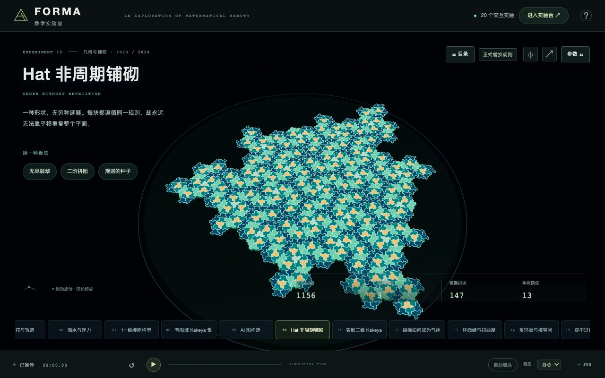

轻度挤出的青绿色 Hat 拼块形成有限铺砌，金色拼块标出合法镜像。

Slightly extruded teal Hat tiles form a finite patch, with valid reflected tiles highlighted in gold.

模型边界：画面是无限非周期铺砌的一块有限区域；有限图案或动画本身不能证明非周期性。高度只用于展示，不属于原始平面数学定义。

打开 / Open: `index.html#hat` · t = 0.000 s · seed = 42.

[场景 / Scene](../src/experiments/hat.js) · [数学 / Math](../src/math/hat.js) · [原始图片 / Raw JPEG](https://raw.githubusercontent.com/aelf-hzz780/math-lab-3js/main/docs/screenshots/10-hat.jpg)

- [Hat · 作者与论文](https://cs.uwaterloo.ca/~csk/hat/)
- [BSD 3-Clause 原始生成器](https://github.com/isohedral/hatviz)

## 11 · 实数三维 Kakeya / Real-space three-dimensional Kakeya tubes

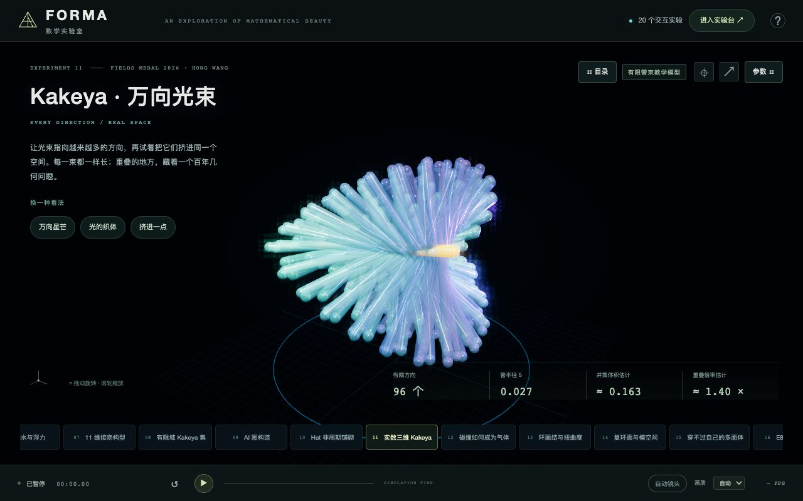

多方向的彩色细管在实数空间中交织，管径与重叠控制揭示体积和方向之间的关系。

Colored tubes in real three-dimensional space reveal direction, thickness, overlap, and sampled occupied volume.

模型边界：这里只采样有限方向，显示的是有限半径管束；不是一个包含全部方向的无限 Kakeya 集，不构成新极值构造、反例或定理证明。有限体积估计不能推出 Hausdorff 维数，也不能把“维数 3”理解为“必须有正体积”。Halton 求积存在离散误差，尤其在很细的管径下；画面模型长度统一为 1。

打开 / Open: `index.html#real-kakeya` · t = 0.000 s · seed = 42.

[场景 / Scene](../src/experiments/real-kakeya.js) · [数学 / Math](../src/math/real-kakeya.js) · [原始图片 / Raw JPEG](https://raw.githubusercontent.com/aelf-hzz780/math-lab-3js/main/docs/screenshots/11-real-kakeya.jpg)

- [IMU · 2026 Fields Medal 官方名单与王虹颁奖词](https://www.mathunion.org/imu-awards/fields-medal/fields-medals-2026)
- [Wang–Zahl · 三维 Kakeya 论文（2025）](https://arxiv.org/abs/2502.17655)

## 12 · 碰撞如何成为气体 / Hard spheres and collision histories

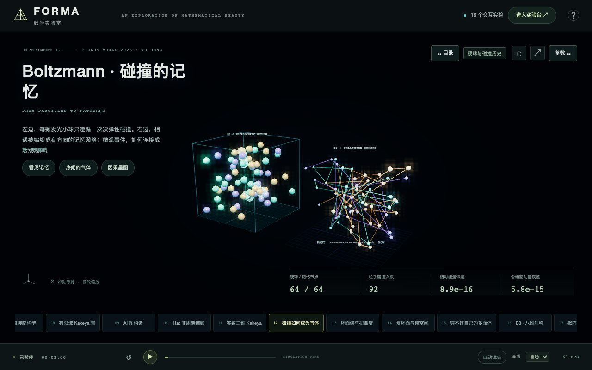

发光硬球在箱中碰撞，一旁的历史图记录粒子间的相遇，连接微观运动与统计描述。

Luminous hard spheres collide in a box while a history diagram records encounters and connects dynamics to statistics.

模型边界：有限数量、有限时间步的弹性硬球教学模型，不是 Boltzmann–Grad 极限、分子混沌证明或完整的论文 molecules。接触时刻与位置存在步长误差，重叠用局部修正处理；能量与含墙面交换的动量按弹性规则守恒。反转速度用于实验，不保证有限步算法逐帧严格可逆。历史只显示最近指定数量的碰撞，超出窗口的父节点连线省略。图的布局不是粒子的空间位置。

打开 / Open: `index.html#boltzmann` · t = 2.000 s · seed = 42.

[场景 / Scene](../src/experiments/boltzmann.js) · [数学 / Math](../src/math/boltzmann.js) · [原始图片 / Raw JPEG](https://raw.githubusercontent.com/aelf-hzz780/math-lab-3js/main/docs/screenshots/12-boltzmann.jpg)

- [IMU · 2026 Fields Medal 官方名单与邓煜颁奖词](https://www.mathunion.org/imu-awards/fields-medal/fields-medals-2026)
- [Deng–Hani–Ma · 硬球到 Boltzmann（v3, 2025）](https://arxiv.org/abs/2408.07818v3)
- [Deng–Hani–Ma · 从牛顿力学到流体方程（2025）](https://arxiv.org/abs/2503.01800)

## 13 · 环面结与扭曲度 / Torus knots and distortion

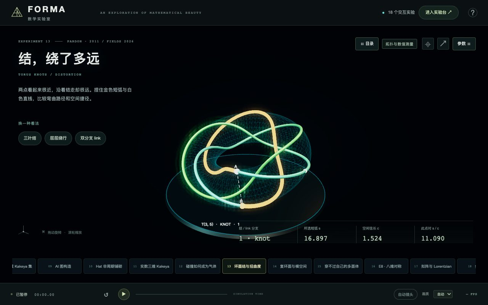

彩色管状结绕过环面，选定两点的短弧与弦展示路径绕行程度。

A colored tubular knot wraps a torus; the shorter arc and chord between selected points reveal detour distance.

模型边界：当前数值是一个选定点对的短弧/弦长比，不是该曲线的全局 distortion，也不是结型在所有嵌入中的最优值。管壁厚度仅为显示；测量对象是管的中心曲线。多分支 link 的测量始终在同一分支内。有限管面网格和弧长积分有数值误差；本实验不复现 Pardon 的证明。

打开 / Open: `index.html#torus-knot` · t = 0.000 s · seed = 42.

[场景 / Scene](../src/experiments/torus-knot.js) · [数学 / Math](../src/math/torus-knot.js) · [原始图片 / Raw JPEG](https://raw.githubusercontent.com/aelf-hzz780/math-lab-3js/main/docs/screenshots/13-torus-knot.jpg)

- [Pardon · On the distortion of knots on embedded surfaces (2011)](https://annals.math.princeton.edu/2011/174-1/p21)
- [原始预印本 arXiv:1010.1972](https://arxiv.org/abs/1010.1972)
- [IMU · 2026 Fields Medals](https://www.mathunion.org/imu-awards/fields-medal/fields-medals-2026)

## 14 · 复环面与模空间 / Complex tori and elliptic-curve moduli

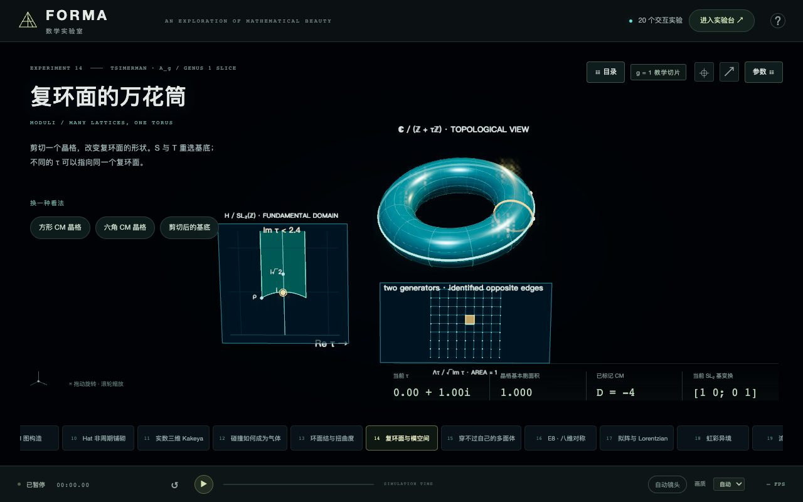

复数参数控制晶格形状，基本域与特殊点对应三维环面的教学示意。

A complex parameter changes a lattice; a fundamental domain and special points accompany an illustrative torus.

模型边界：三维甜甜圈不是平坦复环面的等距嵌入，不能从外形量出复结构。晶格为了容纳在画面中会统一缩放，指标面积 1 指未显示缩放前的数学晶格。基本域上方在有限高度截断；CM 标记仅识别 i、ρ、i√2 及其模群等价点，“未标注”不表示不是 CM 点。这里没有计算所有特殊点，也不复现 A_g 的 André–Oort 证明。

打开 / Open: `index.html#moduli` · t = 0.000 s · seed = 42.

[场景 / Scene](../src/experiments/moduli.js) · [数学 / Math](../src/math/moduli.js) · [原始图片 / Raw JPEG](https://raw.githubusercontent.com/aelf-hzz780/math-lab-3js/main/docs/screenshots/14-moduli.jpg)

- [Tsimerman · The André–Oort conjecture for A_g (v5)](https://arxiv.org/abs/1506.01466v5)
- [Modular group · 基本域与生成元](https://en.wikipedia.org/wiki/Modular_group)
- [Complex multiplication · 算术特殊点](https://en.wikipedia.org/wiki/Complex_multiplication)
- [IMU · 2026 Fields Medals](https://www.mathunion.org/imu-awards/fields-medal/fields-medals-2026)

## 15 · 穿不过自己的多面体 / Noperthedron and Rupert projection test


青色与金色多面体呈现两个姿态，下方叠加正交投影，实时测试严格包含余量。

Teal and gold polyhedra show two poses; overlaid orthogonal silhouettes measure strict containment clearance.

模型边界：Noperthedron 来自 Steininger–Yurkevich 2025 预印本（2026 v2），不属菲尔兹奖成果。原始整数系数保留，三角函数及投影测试使用浮点数；这里的有限姿态搜索不替代论文的计算机辅助全局证明。s < 1 时允许缩小副本，不能当成同尺寸穿越。

打开 / Open: `index.html#noperthedron` · t = 0.000 s · seed = 42.

[场景 / Scene](../src/experiments/noperthedron.js) · [数学 / Math](../src/math/noperthedron.js) · [原始图片 / Raw JPEG](https://raw.githubusercontent.com/aelf-hzz780/math-lab-3js/main/docs/screenshots/15-noperthedron.jpg)

- [Steininger & Yurkevich · 原论文 v2](https://arxiv.org/abs/2508.18475v2)
- [作者的 90 顶点坐标 · 固定版本](https://github.com/Jakob256/Rupert/blob/1009a4c451dbdbb1a1705d18461cbabd534a0a6c/src/noperthedron.py)
- [作者的验证 Notebook](https://github.com/Jakob256/Rupert/blob/1009a4c451dbdbb1a1705d18461cbabd534a0a6c/src/noperthedron_verification.ipynb)

## 16 · E8 · 八维对称 / E8 root system in eight dimensions


240 个根的三维投影呈现晶格对称，选中根的真实八维邻接关系被高亮。

A projection of 240 roots reveals E8 symmetry, highlighting genuine eight-dimensional neighbors of a selected root.

模型边界：这是 E8 晶格最短向量构成的有限根系，不是完整无限晶格。投影丢失五个维度，画面重叠和距离不代表八维距离；球点半径为显示大小。演示没有复现 Viazovska 的 Fourier 分析最优性证明，也不把 2016 年定理标为 2026 年新发现。

打开 / Open: `index.html#e8` · t = 0.000 s · seed = 42.

[场景 / Scene](../src/experiments/e8.js) · [数学 / Math](../src/math/e8.js) · [原始图片 / Raw JPEG](https://raw.githubusercontent.com/aelf-hzz780/math-lab-3js/main/docs/screenshots/16-e8.jpg)

- [IMU · 2022 Fields Medal / Viazovska](https://www.mathunion.org/imu-awards/fields-medal/fields-medals-2022)
- [Viazovska 2016 · The sphere packing problem in dimension 8](https://arxiv.org/abs/1603.04246)
- [Annals of Mathematics · 2017 正式论文](https://annals.math.princeton.edu/2017/185-3/p07)

## 17 · 拟阵与 Lorentzian / Graphic matroid and Lorentzian basis polynomial

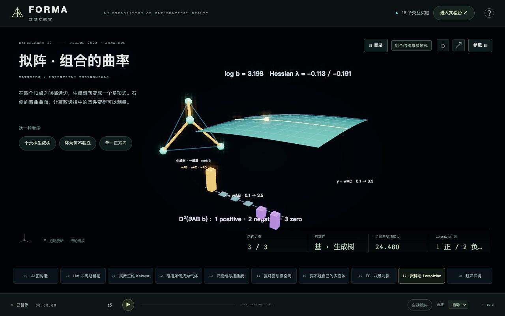

四面体图中的选边呈现独立集与生成树，权重改变基多项式的对数曲面；特征值柱展示 Lorentzian 符号。

Selected tetrahedral graph edges reveal independent sets and spanning trees; weights change a log-polynomial surface, while eigenvalue bars show its Lorentzian signature.

模型边界：K₄ 是经典的小型图拟阵，三维四面体布局只是图的画法。右侧只是六变量多项式的二维正权重截面，图像或有限采样本身不证明普遍对数凹性。实验采用生成树枚举和解析导数；谱值的数值计算与已知精确值对照，不复现全部 Hodge 理论或 Lorentzian 定理证明。这里的 Lorentzian 不表示物理时空或相对论。

打开 / Open: `index.html#matroid` · t = 0.000 s · seed = 42.

[场景 / Scene](../src/experiments/matroid.js) · [数学 / Math](../src/math/matroid.js) · [原始图片 / Raw JPEG](https://raw.githubusercontent.com/aelf-hzz780/math-lab-3js/main/docs/screenshots/17-matroid.jpg)

- [IMU · June Huh / 2022 Fields Medal](https://www.mathunion.org/imu-awards/fields-medal/fields-medals-2022)
- [Brändén–Huh · Lorentzian polynomials](https://arxiv.org/abs/1902.03719)
- [IMU · Huh 获奖工作详述](https://www.mathunion.org/fileadmin/IMU/Prizes/Fields/2022/IMU_Fields22_Huh_citation.pdf)

## 18 · 虹彩异境 / Iridescent Strata

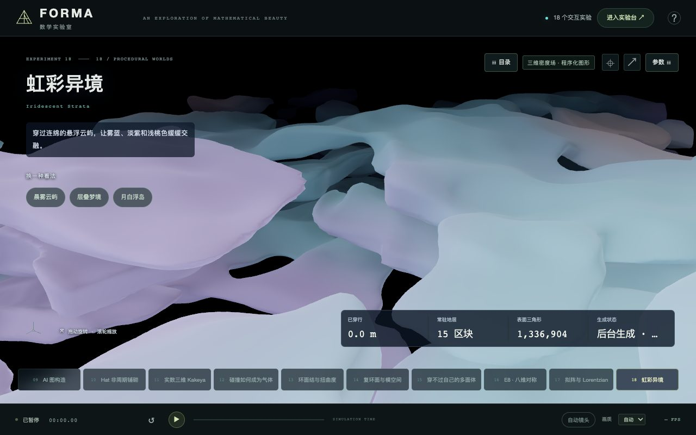

圆润的悬浮云屿与孔洞在暗色空间中层叠，雾蓝、淡紫和浅桃沿表面连续晕染；宽光源与分块密度场支持柔和的穿行体验。

Rounded floating forms and openings layer through a dark space, with mist blue, lavender and pale peach blending continuously across their surfaces; broad lighting and streamed density meshes create a soft flight experience.

模型边界：这是受 Cristian Peñas 的程序化地形视频启发的原创图形实验。我们尚未取得或核验作者的具体算法，不声称复现其 Unity 实现，也不把它作为 AI 发现的新数学结构。孔洞由有限网格近似，小于网格的细节可能消失；虹彩包含艺术化着色，并非测量所得物理光谱。这是云团般的表面近似，不计算真实云雾的体积散射。持续生成只覆盖相机附近的有限窗口，手动远离该窗口可能看到边缘；不模拟碰撞、岩石物理或地质演化。

打开 / Open: `index.html#iridescent-terrain` · t = 0.000 s · seed = 42.

[场景 / Scene](../src/experiments/iridescent-terrain.js) · [数学 / Math](../src/math/iridescent-terrain.js) · [原始图片 / Raw JPEG](https://raw.githubusercontent.com/aelf-hzz780/math-lab-3js/main/docs/screenshots/18-iridescent-terrain.jpg)

- [视觉参考 · Cristian Peñas / @ilumine_ai · 2026-09-11](https://x.com/ilumine_ai/status/2098342499865821654)
- [作者相关说明 · procedural latent space / Unity](https://x.com/ilumine_ai/status/2098052245900448127)
- [Paul Bourke · Polygonising a scalar field / tetrahedrons](https://paulbourke.net/geometry/polygonise/)
- [Three.js · MeshPhysicalMaterial / iridescence](https://threejs.org/docs/#api/en/materials/MeshPhysicalMaterial)

图像总大小 / Total image size: 1765 KiB. Bundle SHA-256: `eea289fa7e8dcc17a3a50e2bad43a4f14631efb9707572287084bb9d05e323f1`.
